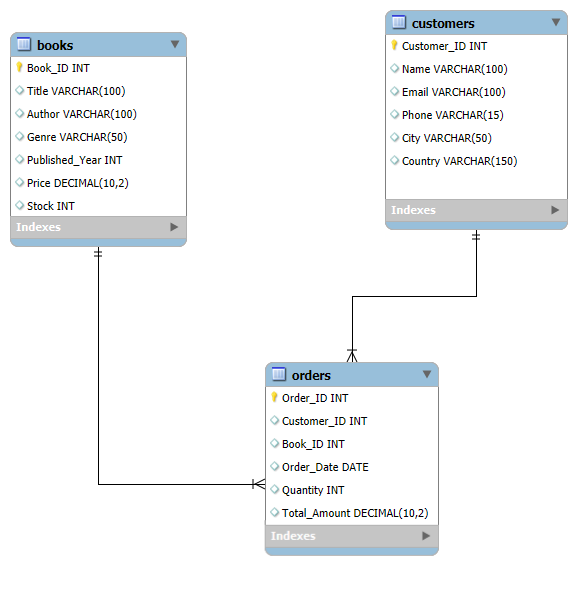

# Bookstore Data Analysis

A PostgreSQL-based data analysis project focused on exploring bookstore sales, customer behavior, product performance, author performance, and inventory levels.

## Project Overview

This project uses a relational bookstore database containing information about books, customers, and orders.

The objective is to use SQL to extract meaningful business insights from the data while demonstrating practical SQL querying and analytical techniques.

## Database Structure

The database consists of three main tables:

### Books

Contains information about the books available in the catalog.

- Book ID
- Title
- Author
- Genre
- Published Year
- Price
- Stock

### Customers

Contains customer information.

- Customer ID
- Name
- Email
- Phone
- City
- Country

### Orders

Contains transaction information.

- Order ID
- Customer ID
- Book ID
- Order Date
- Quantity
- Total Amount

### Relationships



- One customer can place multiple orders.
- One book can appear in multiple orders.
- `Orders.Customer_ID` references `Customers.Customer_ID`.
- `Orders.Book_ID` references `Books.Book_ID`.

## Analysis Performed

### 1. Data Exploration

- Identify books belonging to a specific genre
- Identify books published after a given year
- Identify customers based in a specific country
- Retrieve orders from a specific date range
- Identify distinct book genres

### 2. Product Catalog Analysis

- Identify the most expensive book
- Calculate the average price of Fantasy books

### 3. Sales & Revenue Analysis

- Calculate total revenue
- Analyze books sold across genres
- Retrieve high-value orders
- Identify the most frequently ordered books

### 4. Customer Analysis

- Identify repeat customers
- Identify customers ordering multiple copies
- Identify the highest-spending customer
- Analyze cities associated with high-value orders

### 5. Author Analysis

- Analyze the total quantity of books sold by each author

### 6. Inventory Analysis

- Calculate total stock
- Identify books with minimum stock
- Calculate remaining inventory after recorded orders

### 7. Advanced SQL Analysis

- Rank the top three most expensive Fantasy books using a window function

## SQL Concepts Demonstrated

- `SELECT`
- `WHERE`
- `DISTINCT`
- `ORDER BY`
- `LIMIT`
- `BETWEEN`
- Aggregate Functions
  - `SUM()`
  - `AVG()`
  - `COUNT()`
  - `MIN()`
  - `MAX()`
- `GROUP BY`
- `HAVING`
- `INNER JOIN`
- `LEFT JOIN`
- `COALESCE()`
- Subqueries
- Window Functions
- `RANK()`

## Key Business Insights

- The highest-priced book in the catalog is **"Proactive system-worthy orchestration"**, priced at **$49.98**.
- The bookstore generated **$75,628.66** in recorded revenue.
- **Mystery** is the best-performing genre with **504 books sold**, followed by Science Fiction and Fantasy.
- Seven books share the highest order frequency, with each appearing in **four orders**.
- **Kim Turner** is the highest-spending customer with total recorded spending of **$1,398.90**.
- **139 customers** have placed more than one order.
- Five books have a stock level of **zero**, indicating potential inventory replenishment requirements.
- **Patrick Contreras** is the top-selling author in the dataset with **28 books sold**.
- Inventory analysis shows that remaining stock should be evaluated alongside historical sales demand when making replenishment decisions.

## Project Structure

```text
Bookstore-Data-Analysis/
│
├── .gitignore
├── README.md
│
├── sql/
│   └── bookstore_analysis.sql
│
└── data/
    ├── Books.csv
    ├── Customers.csv
    └── Orders.csv
```

## How to Use

1. Clone the repository.
2. Create a PostgreSQL database.
3. Run the table creation section of `sql/bookstore_analysis.sql`.
4. Import the CSV files from the `data/` directory.
5. Run the analysis queries in `sql/bookstore_analysis.sql`.

> **Note:** The `COPY` commands in the SQL file currently use local file paths. These paths may need to be updated according to the PostgreSQL environment and file locations on the user's system.

## Author

**Aman Alam**
